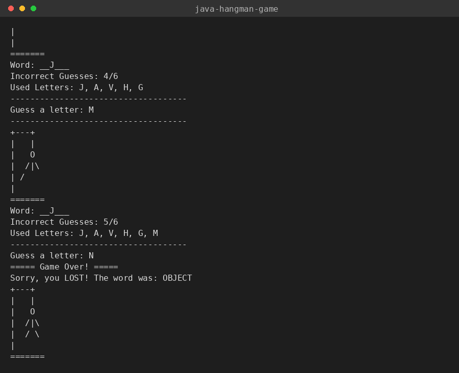
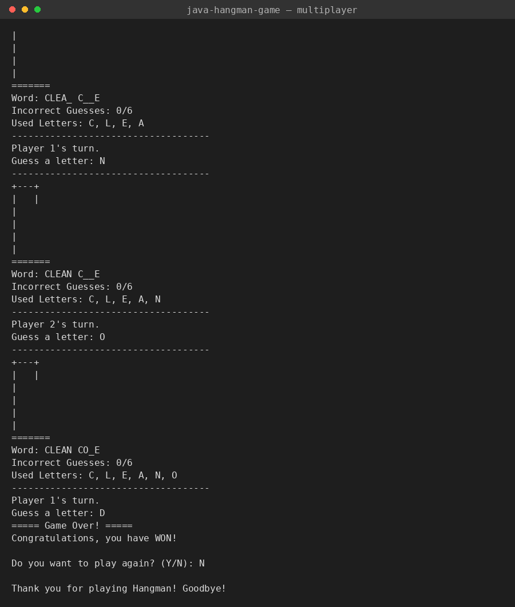

# Java Hangman Game


A console-based Hangman game in Java, supporting both a computer-chosen
word and a multiplayer mode where one player sets a custom word or phrase
for the others to guess in turns.

Originally built as coursework (Programming Fundamentals module) and
reorganized here into a clean, tested, portfolio-ready structure.

## Gameplay

### Single player


### Multiplayer with a custom phrase


## Features

- Two game modes: a built-in word list, or a custom word/phrase entered by
  one player for the rest of the group to guess.
- Multiplayer turn tracking — the game announces whose turn it is.
- Full input validation: single-letter guesses only, repeated guesses are
  caught, and custom phrases are restricted to letters and spaces.
- ASCII-art hangman that builds up with each incorrect guess.
- Replay prompt to start a new round without restarting the program.

## Technologies

- Java 17+
- Maven (build + dependency management)
- JUnit 5 (tests)

## Project Structure

```
java-hangman-game/
├── src/
│   ├── main/java/hangman/
│   │   ├── Main.java        # Entry point: setup, game loop, replay
│   │   ├── Game.java        # Core game rules (no I/O — unit testable)
│   │   ├── ConsoleUI.java   # All console input/output
│   │   └── WordBank.java    # Built-in word list
│   └── test/java/hangman/
│       └── GameTest.java    # JUnit tests for Game
├── docs/
│   └── design.md
├── screenshots/
└── pom.xml
```

## Requirements

- JDK 17 or newer
- Maven 3.6+

## Installation

```bash
git clone <repository-url>
cd java-hangman-game
```

## Running the Game

```bash
mvn compile exec:java
```

Or build a runnable jar:

```bash
mvn package
java -jar target/java-hangman-game-1.0.0.jar
```

## How to Play

1. Enter the number of players (1 for single player, 2+ for multiplayer).
2. Choose a game mode: enter your own word/phrase, or let the computer pick.
3. Take turns guessing one letter at a time.
4. Guess the full word before six incorrect guesses fill the hangman.

## Testing

```bash
mvn test
```

`GameTest` covers word masking, correct/incorrect guesses, repeated-guess
handling, case-insensitivity, and the win/loss conditions.

## Future Improvements

- A difficulty setting (word length / category)
- A larger, categorized word bank
- A simple score/streak counter across rounds
- A GUI version (JavaFX or Swing)

## License

MIT — see [LICENSE](LICENSE). The copyright placeholder in that file can be
replaced with your name before publishing.
