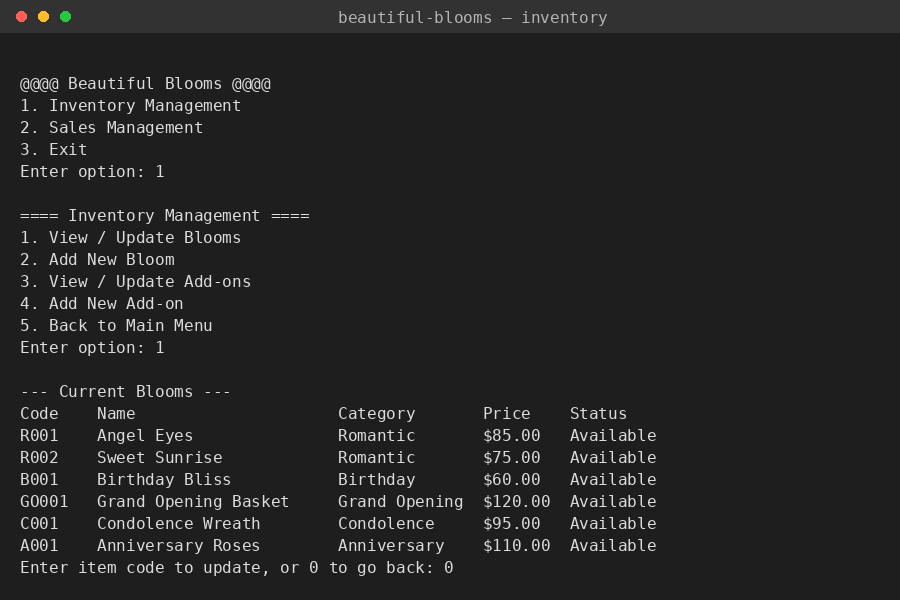
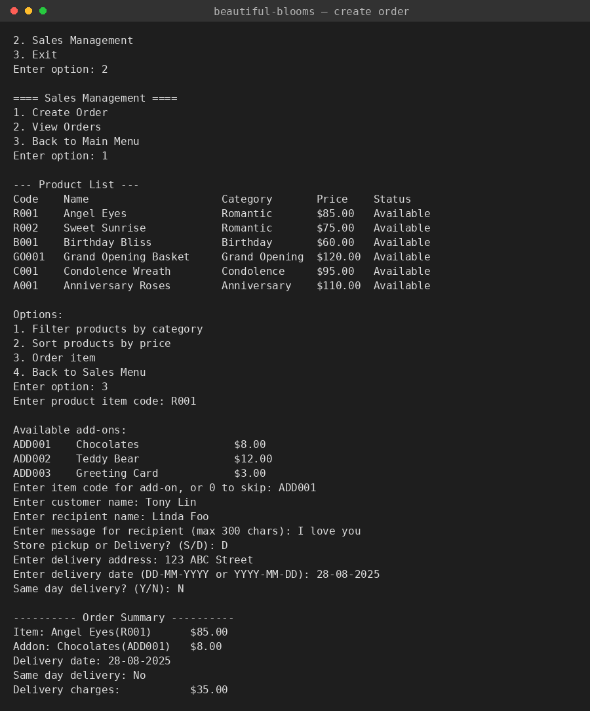

# Beautiful Blooms — Flower Shop Inventory Management System


A console-based Python application for managing a small flower shop's
inventory and sales: tracking blooms and add-ons, and running the full
customer order workflow from product selection through to delivery.

Originally built as a group coursework project (Diploma in Information
Technology — Problem Solving module) and reorganized here into a clean,
tested, portfolio-ready structure.

## Screenshots

### Inventory Management


### Creating an Order


## Features

- **Inventory management** — view, update, and add blooms and add-ons, with
  auto-generated item codes (e.g. `R003`, `ADD004`) and input validation.
- **Sales workflow** — browse products (filter by category or sort by
  price), attach an optional add-on, and collect delivery details.
- **Delivery fee calculator** — flat delivery fee, same-day surcharge, and
  an automatic weekend surcharge based on the delivery date.
- **Order tracking** — auto-generated order IDs (`BBO-YY-XXXX`) and a
  status workflow (`Open → Preparing → Ready → Closed`, with cancel/reopen
  handled as explicit, restricted transitions).
- **Plain-text persistence** — products, add-ons, and orders are saved to
  simple text files, so data survives between runs with no database setup.
- **Input validation throughout** — invalid prices, blank names, bad dates,
  and out-of-range menu choices are caught with a message instead of
  crashing the program.

## Technologies

- Python 3.11+ (standard library only — no external runtime dependencies)
- Pytest for the automated test suite

## Project Structure

```
flower-shop-inventory/
├── src/flower_shop/     # Application source
│   ├── main.py          # Entry point / top-level menu loop
│   ├── inventory.py     # Inventory Management menu + logic
│   ├── sales.py         # Sales Management menu + logic
│   ├── models.py        # Product, Addon, Order data classes
│   ├── file_handler.py  # Load/save to the data/ text files
│   └── validators.py    # Input validation & code/ID generation
├── data/                # products.txt, addons.txt, orders.txt
├── tests/               # Pytest unit tests
├── docs/                # Design notes and user guide
└── screenshots/         # Example program output
```

## Installation

```bash
git clone <repository-url>
cd flower-shop-inventory
python -m venv .venv
.venv\Scripts\activate      # Windows
source .venv/bin/activate   # macOS/Linux
pip install -r requirements.txt
```

## Usage

```bash
python -m src.flower_shop.main
```

```
@@@@ Beautiful Blooms @@@@
1. Inventory Management
2. Sales Management
3. Exit
Enter option:
```

See [docs/user-guide.md](docs/user-guide.md) for a full walkthrough of every
menu, with sample input and output.

## Testing

```bash
pytest
```

The test suite covers the validation helpers (code/order-ID generation, date
parsing, weekend detection), file load/save round-trips, inventory lookups,
and the delivery-fee calculation rules.

## Future Improvements

- Graphical interface (Tkinter)
- SQLite/MySQL persistence instead of text files
- Basic sales analytics (top sellers, monthly totals)
- Automated error logging
- Cloud backup of the data files

## License

MIT — see [LICENSE](LICENSE). The copyright placeholder in that file can be
replaced with your name before publishing.
